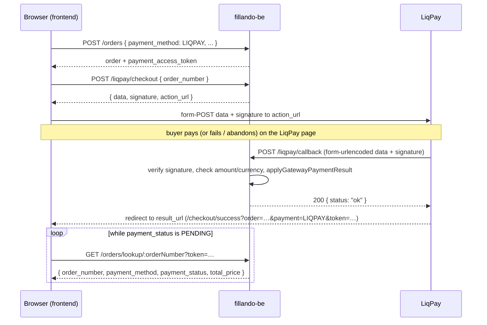

# LiqPay Payment Flow

Modules: `src/modules/liqpay/`, `src/modules/order/`
Helpers: `src/common/services/crypto.util.ts` (`liqpaySignature`, `verifyLiqpaySignature`,
`orderAccessToken`, `verifyOrderAccessToken`)

Paths below are as declared in `endpoints.constant.ts` (no global prefix). On production Nginx
prepends `/api`, so `POST /liqpay/checkout` is reached as `POST /api/liqpay/checkout`.

---

## Overview

LiqPay is an online card-payment gateway. Fillando never talks to LiqPay's API directly to
charge a card — the browser is handed a signed payload, auto-submits it to the LiqPay checkout
page, and LiqPay reports the outcome **server-to-server** to `POST /liqpay/callback`. That
callback is the only LiqPay-driven change to `payment_status` (admin edits and order cancellation are
covered in `ORDER_ADMIN_API.md`).

Two independent things happen after the buyer finishes on the LiqPay page:

1. LiqPay calls our `server_url` (the callback) — this is the **source of truth**.
2. LiqPay redirects the buyer's browser to our `result_url` (the frontend success page) —
   this is **only a navigation**, it carries no trustworthy status.

Because the frontend cannot learn the outcome from the redirect alone, and guests have no JWT
to read their order, the API exposes a public, token-protected read of the payment status:
`GET /orders/lookup/:orderNumber?token=…` (see below).

LiqPay credentials (`public_key`, `private_key`, `sandbox`) are not env vars — they live in
the `payment_providers` collection (encrypted) and are read through
`PaymentProvidersService.getActiveCredentials(PaymentProvider.LIQPAY)`.

---

## Sequence



### 1. Order is created — `POST /orders`

Standard checkout (`OrderService.create`, `OptionalJwtAuthGuard` so guests are allowed). The
order is stored with `payment_method: LIQPAY`, `payment_status: PENDING`. No confirmation
email is sent for LiqPay orders at this point — the "order paid" email goes out only after
the callback marks the order `PAID`.

For `LIQPAY` orders **only**, the response additionally contains

```json
"payment_access_token": "3f9a1c…(32 hex chars)"
```

This is the token for the public lookup (next sections). It is derived, not stored — there is
no such field in the `orders` document.

### 2. Checkout payload — `POST /liqpay/checkout`

Public endpoint. Body: `{ "order_number": "FO-0000123" }` (validated against `/^FO-\d{7}$/`).

`LiqpayService.buildCheckout`:

- loads the order by number — `404` if it does not exist;
- `400 Це замовлення не оплачується карткою` if `payment_method !== LIQPAY`;
- `400 Замовлення вже оплачено` if `payment_status === PAID` (a paid order can never be sent to
  the gateway again);
- `400 Замовлення скасовано` if `order_status === CANCELLED` or `payment_status` is `VOIDED` /
  `REFUNDED` — a cancelled order must never be charged from a stale "try again" tab. Only
  `PENDING` and `FAILED` orders reach the gateway; that is how a retry works;
- reads the active LiqPay credentials — **before** claiming the session. A provider switched
  off between the checkout render and this submit, or a key that fails to decrypt, answers
  `503 { code: 'LIQPAY_UNAVAILABLE' }` with «Оплату карткою не розпочато …» and leaves
  `liqpay_checkout_started_at` untouched, so the buyer is told nothing was started instead of
  being given a 15-minute clock for a session that never existed. Reading credentials is a
  read, so the two-tab race is still decided by the conditional claim below;
- claims the session with one conditional write (`OrderService.claimLiqpayCheckout`): the
  stamp `liqpay_checkout_started_at = now` is set only if the order is still an unpaid LiqPay
  order and either no session was opened, the previous one is older than
  `LIQPAY_SESSION_COOLDOWN_MS` (15 minutes), or the payment is `FAILED` (a session LiqPay
  itself closed). The same write also sets `payment_status = PENDING`, which is what limits a
  retry after `FAILED` to one live session — see _One live session, retries included_ below.
  Two tabs racing for the same order therefore get exactly one payload, and a refused or
  failed claim hands nothing out. A refused claim is re-read and answered with
  `409 { code: 'LIQPAY_SESSION_ACTIVE', retry_after_seconds }` while the cooldown runs, or a
  `400` when the order was paid or locked meanwhile (TD-0009 §5.4.3);
- builds the LiqPay params:

    | Param         | Value                                                                             |
    | ------------- | --------------------------------------------------------------------------------- |
    | `version`     | `3`                                                                               |
    | `public_key`  | from active provider credentials                                                  |
    | `action`      | `pay`                                                                             |
    | `amount`      | `order.total_price`                                                               |
    | `currency`    | `UAH`                                                                             |
    | `description` | `Оплата замовлення FO-0000123`                                                    |
    | `order_id`    | `order.order_number` — this is how the callback is matched back to our order      |
    | `result_url`  | `${FRONTEND_URL}/checkout/success?order=FO-0000123&payment=LIQPAY&token=<32 hex>` |
    | `server_url`  | `${PUBLIC_API_URL}/liqpay/callback`                                               |
    | `sandbox`     | `'1'` / `'0'` from provider credentials                                           |

- `data = base64(JSON.stringify(params))`,
  `signature = base64(sha1(private_key + data + private_key))` (`liqpaySignature`).

Response: `{ data, signature, action_url: 'https://www.liqpay.ua/api/3/checkout' }`.

#### One live session, retries included

There are no transactions here (standalone MongoDB), so the claim is deliberately a single
`findOneAndUpdate` pinned on the whole state it read — payment method, payment status, order
status and the session stamp. Nothing is written unless the order is still exactly an unpaid
LiqPay order without a live session, and the write is what decides the race.

| Payment before the claim         | Claim   | Payment after | What the buyer gets                                 |
| -------------------------------- | ------- | ------------- | --------------------------------------------------- |
| `PENDING`, no stamp              | granted | `PENDING`     | the payload                                         |
| `PENDING`, stamp < 15 min        | refused | unchanged     | `409 LIQPAY_SESSION_ACTIVE` + `retry_after_seconds` |
| `PENDING`, stamp ≥ 15 min        | granted | `PENDING`     | the payload, stamp refreshed                        |
| `FAILED` (any stamp)             | granted | **`PENDING`** | the payload at once — no waiting for a retry        |
| `FAILED`, second tab in parallel | refused | `PENDING`     | `409 LIQPAY_SESSION_ACTIVE` — the first tab has it  |
| `PAID` / `VOIDED` / `REFUNDED`   | refused | unchanged     | `400` (already paid / cancelled)                    |

TD-0009 §5.4.3 allows a retry after `FAILED` immediately, because LiqPay closed that session
itself, and that stays true: nothing new to wait for. What changed is that the granted retry is
a payment in flight again, so the claim moves `FAILED` back to `PENDING`. Without it both tabs
of a `FAILED` order claimed a session — exactly the double-charge the cooldown exists to
prevent — because `FAILED` is what the order reads until the next callback arrives.

The visible consequence: after a retry is opened, the lookup reports `payment_status: PENDING`
and a counting-down `liqpay_retry_after_seconds`, not `FAILED` with `0`. If the buyer abandons
that retry too, the next one waits out the cooldown or switches payment method — the same rule
that has always applied to a first attempt. A callback reporting the retry as failed puts the
order back to `FAILED`, and the next retry is immediate again.

### 3. Browser form-POST to LiqPay

The frontend renders a hidden `<form method="POST" action={action_url}>` with `data` and
`signature` fields and submits it. From here on the buyer is on LiqPay's domain.

### 4. Server callback — `POST /liqpay/callback`

LiqPay calls `server_url` as `application/x-www-form-urlencoded` with two fields, `data` and
`signature` (`main.ts` enables the `urlencoded` body parser specifically for this).

For any body that passes `LiqpayCallbackDto` validation (`data` and `signature` strings — a body
missing either is rejected with `400` by the global `ValidationPipe` before the controller runs)
the controller answers `200 { status: 'ok' }` and `LiqpayService.handleCallback`
never throws — LiqPay retries on non-2xx, and we do not want retries for payloads we have
already decided to ignore. Every rejection below is logged and silently dropped:

1. No active LiqPay provider configured → `error` log, return.
2. `verifyLiqpaySignature(private_key, data, signature)` fails (constant-time compare) →
   `warn`, return.
3. `data` is not valid base64 JSON → `warn`, return.
4. Payload has no `order_id` → `warn`, return.
5. `order_id` does not match any order → `warn`, return.
6. `status` classification:
    - `success`, `sandbox` → **paid**;
    - `failure`, `error` → **failed**;
    - anything else (`processing`, `wait_accept`, `3ds_verify`, …) → intermediate, ignored.
7. For a **paid** status the payload must have `currency === 'UAH'` and
   `|amount - order.total_price| <= 0.01`; otherwise the order is **not** marked paid
   (`warn` with the reported amount).
8. `transactionId = payload.transaction_id ?? payload.payment_id` (stringified), then
   `OrderService.applyGatewayPaymentResult(orderNumber, isPaid, transactionId)`.

### 5. Applying the result — `OrderService.applyGatewayPaymentResult`

| Current state                        | Gateway says | Result                                                                                                                                                                                                                                                                                                                  |
| ------------------------------------ | ------------ | ----------------------------------------------------------------------------------------------------------------------------------------------------------------------------------------------------------------------------------------------------------------------------------------------------------------------- |
| `payment_status = PAID`              | anything     | No-op (idempotent). Duplicate/late callbacks never downgrade a paid order.                                                                                                                                                                                                                                              |
| `order_status = CANCELLED`, not paid | failed       | Nothing written — `VOIDED` is preserved instead of being overwritten with `FAILED`.                                                                                                                                                                                                                                     |
| `order_status = CANCELLED`, not paid | paid         | `payment_status = PAID`, `payment_transaction_id` stored. Customer gets **no** "paid" email; `SERVICE_EMAIL` gets a "paid after cancellation — refund" notice.                                                                                                                                                          |
| `payment_method ≠ LIQPAY`, not paid  | failed       | Nothing written — the buyer switched to an offline method after opening the card session (TD-0009); a dead card session must not mark a COD order `FAILED`.                                                                                                                                                             |
| `payment_method ≠ LIQPAY`, not paid  | paid         | `payment_status = PAID`, `payment_method` back to `LIQPAY`, `payment_transaction_id` stored. Customer gets the paid email; `SERVICE_EMAIL` is told not to collect the offline sum — with a «ТЕРМІНОВО … зняти … на ТТН» subject when the order is already past `CONFIRMED`, because a COD invoice may be on the parcel. |
| any other order status, not paid     | paid         | `payment_status = PAID`, `payment_transaction_id` stored; customer paid-confirmation email is sent (fire-and-forget, failures logged).                                                                                                                                                                                  |
| any other order status, not paid     | failed       | `payment_status = FAILED`, `payment_transaction_id` stored if present. No email.                                                                                                                                                                                                                                        |

The cancelled-order branch is TD-0003; see `ORDER_ADMIN_API.md` → "Gateway callback on a
cancelled order". The method-change branch is TD-0009: LiqPay only knows order numbers we handed
it while the order was a LiqPay order, so a callback for any other method can only mean the buyer
changed methods after the session was opened. Every write here is pinned on the method it
expects, so a `PATCH …/payment-method` landing between the callback's read and its write cannot
produce a COD order that is PAID, nor a COD order that is FAILED.

### 6. Browser redirect to `result_url`

Independently of step 4, LiqPay sends the buyer's browser to
`${FRONTEND_URL}/checkout/success?order=FO-0000123&payment=LIQPAY&token=<32 hex>`. The
frontend now uses the public lookup to find out what actually happened.

---

## Why `result_url` is not a source of truth

- **It is the same URL for success and failure.** We give LiqPay exactly one `result_url`;
  LiqPay does not append a status to it, and even if it did, a query parameter chosen by the
  browser is not something we could trust.
- **Ordering is not guaranteed.** The server callback and the browser redirect are separate
  requests. In practice the callback usually lands first, but it can arrive seconds later than
  the redirect (or be retried after a transient failure on our side). The success page must
  therefore be prepared to see `payment_status: PENDING` and poll.
- **The buyer may never reach it.** Closing the tab on the LiqPay page skips the redirect
  entirely, while the callback still arrives. State lives in the order, not in the page.

Hence: the page shows a _result_, the callback _decides_ it, and the lookup endpoint lets the
page _read_ the decision.

---

## Public payment-status lookup

### Endpoint

```
GET /orders/lookup/:orderNumber?token=<32 lowercase hex>
```

- **Public** — no guards at all (no JWT, no role). Access is gated solely by the token.
- Declared in `OrderController` next to the other public/user routes; the two-segment
  `/lookup/:orderNumber` cannot collide with the single-segment admin `/:id` route.
- `orderNumber` must match `/^FO-\d{7}$/` (`OrderLookupParamsDto`), `token` must match
  `/^[a-f0-9]{32}$/` (`OrderLookupQueryDto`); anything else is a `400` from the global
  `ValidationPipe` before the service is touched.
- Swagger: `API_OPERATION.ORDERS.LOOKUP`, response schema `OrderPaymentStatusResponseDto`.

### The token

```
orderAccessToken(orderNumber) =
    hex( HMAC-SHA256( key = PAYMENT_ENCRYPTION_KEY, msg = 'order-lookup:' + orderNumber ) )[0:32]
```

- **Stateless.** It is recomputed on every request; nothing is stored in the `orders`
  collection and no schema change was needed. `verifyOrderAccessToken` recomputes the expected
  value and compares with `timingSafeEqual` (after checking both sides are 32-char strings of
  equal byte length). The compare is byte-exact: tokens are issued as lowercase hex and an
  uppercase variant is rejected, not normalised.
- **Deterministic.** The same order always yields the same token, so a URL saved by the buyer
  keeps working; there is no per-order revocation short of rotating `PAYMENT_ENCRYPTION_KEY`.
- **Issued in two places**, both by the backend:
    1. appended to `result_url` as `&token=` in `LiqpayService.buildCheckout`, so the LiqPay
       redirect lands on the success page with everything it needs;
    2. returned as `payment_access_token` in the `POST /orders` response when
       `payment_method === LIQPAY`, so the frontend can start polling even if the redirect never
       happens (e.g. the buyer comes back via history) or store it alongside the order number.

### Behaviour

`OrderService.getPaymentStatusPublic(orderNumber, token)`:

1. `verifyOrderAccessToken(orderNumber, token)` is `false` → `404 Order FO-0000123 not found`.
   Deliberately **404, not 403** — a wrong token must produce exactly the same response as a
   non-existent order, so order numbers (which are sequential and therefore guessable) cannot be
   probed for existence.
2. Token valid → `findByNumber(orderNumber)` (`404` if the order really does not exist).
3. Returns **only**:

```json
{
	"order_number": "FO-0000123",
	"payment_method": "LIQPAY",
	"payment_status": "PAID",
	"total_price": 1299.5,
	"order_status": "NEW",
	"delivery_method": "NOVA_POST",
	"can_change_payment_method": false,
	"liqpay_retry_after_seconds": null
}
```

No customer data, no items, no delivery address, no `_id`. `payment_method` is included so
the same page can, in future, serve other gateways; today it will be `LIQPAY` in practice, but
the endpoint itself does not restrict the payment method. The last three fields exist for the
payment-method change (TD-0009): `delivery_method` decides which offline methods fit (COD needs
a carrier, CASH needs pickup) and `can_change_payment_method` is computed by the server — true
while the payment is `PENDING` or `FAILED` and the order is `NEW` or `CONFIRMED` — so the
storefront never mirrors the rule. `liqpay_retry_after_seconds` is the cooldown clock —
`null` when no card session was ever opened (offer "pay now" at once), `0` when a new session
may be opened, otherwise the seconds left — the same number the refused checkout carries, so
the page can show a countdown instead of a button that is bound to fail.

### Changing the payment method — `PATCH /orders/lookup/:orderNumber/payment-method?token=`

Same token, same 404 for a wrong one, throttled to **5 requests / minute per IP** (it writes and
sends mail). Body `{ "payment_method": "COD" | "IBAN" | "CASH" }` — card is not a target; moving
an offline order onto LiqPay stays an admin action.

`OrderService.changePaymentMethod` (shared with the signed-in
`PATCH /orders/me/:id/payment-method`, which uses ownership instead of the token):

1. Same method as the order already has → `200`, nothing written, no mail (a double click must
   not send two mails).
2. `payment_status ∉ {PENDING, FAILED}` or `order_status ∉ {NEW, CONFIRMED}` →
   `409 { code: 'PAYMENT_METHOD_LOCKED' }`. From `PROCESSING` on the parcel may already carry a
   COD invoice; the admin can still change it via `PATCH /orders/:id`.
3. Delivery rule → `400` (COD only with `NOVA_POST`/`COURIER`, CASH only with `PICKUP`).
4. `findOneAndUpdate` **pinned on the state read** in step 2 — payment status, order status
   **and the current method**: a callback that flipped the payment to `PAID` in between, or a
   second tab that already switched the method, makes the filter miss. The miss is re-read once:
   the requested method already there → `200` no-op (the other tab won), anything else →
   `409 PAYMENT_METHOD_LOCKED` rather than a card-paid order labelled COD. `FAILED` becomes `PENDING` (a declined card attempt is not a
   fact about an IBAN order); `PENDING` stays.
5. Mail: the customer gets the confirmation template of the new method with its opening
   sentence changed («Спосіб оплати замовлення … змінено на …»), the service a «Зміна способу
   оплати» note naming the old and new methods.

Response: the extended lookup shape above.

### Intended frontend behaviour (`/checkout/success`)

1. Read `order` and `token` from the URL (or from the `POST /orders` response kept in memory).
   Without a token the page cannot look anything up — show a neutral "we will confirm by
   e-mail" message rather than a success.
2. Call the lookup immediately, then **poll while `payment_status === 'PENDING'`** (a few
   seconds interval, with an upper bound — after which show "still processing, you will get an
   e-mail"). The callback normally lands within a second or two.
3. `PAID` → render the success state. **Fire conversion / analytics events only here**, never on
   page load — the page is reached on failure too.
4. `FAILED` → render the failure state with a "try again" action that calls
   `POST /liqpay/checkout` with the same `order_number` and re-submits the form, and a
   "choose another payment method" action that calls the payment-method `PATCH`. A granted
   retry turns the order back into `PENDING`, so a page that polls after it will see `PENDING`,
   not `FAILED`, and a second "try again" from another tab gets `409 LIQPAY_SESSION_ACTIVE`. The checkout
   endpoint allows a retry for `PENDING` and `FAILED` orders only: already-`PAID` ones get
   `400 Замовлення вже оплачено` (a double-submit after a late callback cannot charge twice) and
   cancelled ones get `400 Замовлення скасовано`. Messages are Ukrainian because the storefront
   shows them to the buyer as they are.
5. `PENDING` after the polling window → the same two actions. "Pay now" may answer
   `409 LIQPAY_SESSION_ACTIVE` with `retry_after_seconds`; tell the buyer to wait or to pick
   another method — the cooldown is what makes offering the button safe. It may also answer
   `503 LIQPAY_UNAVAILABLE`: nothing was started, so keep both actions available and show the
   message as it is (a `FAILED` order stays `FAILED` — no clock appears).
6. `VOIDED` / `REFUNDED` → the order was cancelled; show that instead of a retry button (the
   server rejects a retry anyway, the frontend gate is UX, not security). `can_change_payment_method`
   is `false` here too, so no method change is offered.

---

## Security notes

- The token unlocks a handful of non-personal fields and one write: switching an unpaid order
  to an offline method. Even a leaked token (browser history, referrer headers, shared screenshot
  of the URL) reveals only that a given order number exists, whether it is paid, how it ships
  and whether the method may still change; the write moves no money and exposes no data.
- Wrong token and unknown order are indistinguishable (`404` with the same message), and the
  comparison is constant-time, so the endpoint does not act as an order-number oracle.
- Do not log the token. Order numbers are fine to log (they already appear everywhere).
- A provider that cannot be read never becomes the buyer's problem to guess at: the checkout
  answers `503 LIQPAY_UNAVAILABLE`, the failure is logged with the order number, and no session
  stamp is written — a misconfigured or rotated key cannot lock an order out of paying for
  15 minutes.
- **Rate limits** (`@nestjs/throttler`, opt-in per handler — `API_AND_SWAGGER.md` §4a):
  the lookup 30 / minute per IP, the payment-method `PATCH` 5 / minute, `POST /liqpay/checkout`
  10 / minute. No DB hit happens before the token is verified, so a rejected request costs one
  HMAC.
- The token travels in the query string, so it would appear in request logs: `app.module.ts`
  redacts `req.query.token` and rewrites `token=` in the logged URL. Nginx access logs on the
  server still see the full URL — treat them accordingly.
- `PAYMENT_ENCRYPTION_KEY` is shared with the AES-256-GCM encryption of payment-provider
  credentials (`encrypt`/`decrypt` in `crypto.util.ts`). Rotating it invalidates every issued
  lookup token **and** requires re-encrypting stored provider credentials — treat it as one
  operation.
- The callback trusts nothing from the request except what the LiqPay signature covers:
  signature check first, then amount/currency check against **our** stored `total_price`, and
  `order_id` must resolve to a real order. A forged callback without the private key cannot
  mark anything paid.

---

## Config

| Variable                 | Used for                                                                                                                                                                             |
| ------------------------ | ------------------------------------------------------------------------------------------------------------------------------------------------------------------------------------ |
| `PUBLIC_API_URL`         | Base of `server_url` (`${PUBLIC_API_URL}/liqpay/callback`). Must be the **externally reachable** HTTPS origin of the API including any `/api` prefix — LiqPay calls it from outside. |
| `FRONTEND_URL`           | Base of `result_url` (`${FRONTEND_URL}/checkout/success?...`). Also the CORS origin in `main.ts`.                                                                                    |
| `PAYMENT_ENCRYPTION_KEY` | HMAC key for lookup tokens **and** AES key for encrypted provider credentials. Min 32 chars (validated at startup by the Zod env schema).                                            |

LiqPay `public_key` / `private_key` / `sandbox` are stored per provider in the
`payment_providers` collection and managed via the payment-providers admin endpoints, not via
env.

In tests `test/jest.setup.ts` seeds all three variables
(`PAYMENT_ENCRYPTION_KEY = 'test-payment-encryption-key-32-chars'`,
`PUBLIC_API_URL = http://localhost:3000`, `FRONTEND_URL = http://localhost:9000`).

---

## Related docs

- `fillando-meta` → `docs/designs/TD-0001-liqpay-integration.md` — original LiqPay design
- `fillando-meta` → `docs/designs/TD-0003-order-cancellation-payment-status.md` — `VOIDED` and
  the cancelled-order callback rule
- `fillando-meta` → `docs/architecture/state-machines.md` — `order_status` / `payment_status`
  transitions
- `src/docs/ORDER_ADMIN_API.md` — admin endpoints, manual payment-status changes
- `src/docs/DATA_MODELS.md` — `orders` collection (`payment_status`, `payment_transaction_id`)
